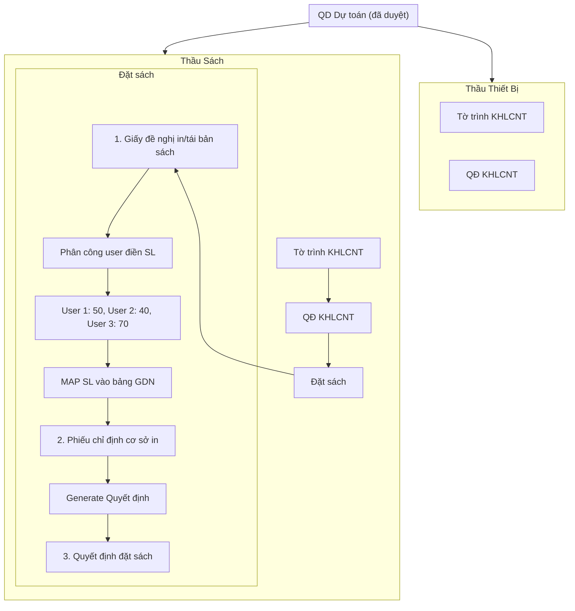

## Tổng quan kiến trúc hiện tại

- **Backend:** NestJS + Prisma ORM + PostgreSQL + MinIO (file storage)
- **Frontend:** Next.js (App Router) + TypeScript + Tailwind CSS
- **Docx gen:** Thư viện `docx` npm, điền placeholders từ template
- **Frontend API:** `frontend/src/lib/api.ts` — tất cả gọi qua `/api`

---

## Phase 1: Thay đổi Database Schema (Prisma)

**File:** `backend/prisma/schema.prisma`

### 1.1. Thêm enum `ProcurementType`

```prisma
enum ProcurementType {
  THAU_THIET_BI
  THAU_SACH
}
```

### 1.2. Thêm enum `DatSachDocType`

```prisma
enum DatSachDocType {
  GDN_IN_SACH      // Giấy đề nghị in sách
  PCDI_CS_IN       // Phiếu chỉ định cơ sở in
  QD_DAT_SACH      // Quyết định đặt sách (generated)
}
```

### 1.3. Thêm model `DatSachProject`

Luu thong tin du an Thầu Sách, loại thầu, trạng thái, nguoi tao.

```prisma
model DatSachProject {
  id                    String          @id @default(uuid())
  parentId              String          @map("parent_id")        // QD_DUTOAN
  procurementType       ProcurementType @default(THAU_SACH)
  tenDuAn              String          @map("ten_du_an")
  status                String          @default("DRAFT")        // DRAFT, PENDING_GDN, PENDING_PCDI, COMPLETED
  createdBy             String          @map("created_by")
  createdAt             DateTime        @default(now()) @map("created_at")
  updatedAt             DateTime        @updatedAt @map("updated_at")

  creator               User            @relation(fields: [createdBy], references: [id])
  gdnInDocuments       GDNInSach[]
  pcDiDocuments         PCDICoSoIn[]

  @@map("dat_sach_projects")
}
```

### 1.4. Thêm model `GDNInSach`

Luu thong tin Giay de nghi in/tai ban sach.

```prisma
model GDNInSach {
  id                String          @id @default(uuid())
  datSachProjectId String          @map("dat_sach_project_id")
  status           String          @default("DRAFT")   // DRAFT, PENDING, APPROVED
  data             Json            @default("{}")
  // Template fields
  // {TenSach, TacGia, BBT, NamXB, SoTrang, KhoSach, GiaBia, SoLuongTon, SLDeNghiIn, ThoiGianCanSach, DeNghiNoiIn, GhiChu}
  // SLDeNghiIn la map: { userId1: soluong1, userId2: soluong2 }
  // Moi cot (cot so luong) co the co assignment khac nhau
  createdBy        String          @map("created_by")
  createdAt        DateTime        @default(now()) @map("created_at")
  updatedAt        DateTime        @updatedAt @map("updated_at")

  datSachProject   DatSachProject @relation(fields: [datSachProjectId], references: [id])
  creator          User           @relation(fields: [createdBy], references: [id])
  assignments      GDNAssignment[]

  @@map("gdn_in_sach")
}
```

### 1.5. Thêm model `GDNAssignment`

Luu thong tin phan cong user dien so luong cho moi cot trong bang.

```prisma
model GDNAssignment {
  id              String      @id @default(uuid())
  gdnInSachId    String      @map("gdn_in_sach_id")
  userId          String      @map("user_id")
  assignedBy      String      @map("assigned_by")
  assignedAt      DateTime    @default(now()) @map("assigned_at")
  soLuong         Int         @default(0)    @map("so_luong")
  completedAt     DateTime?   @map("completed_at")

  gdnInSach       GDNInSach  @relation(fields: [gdnInSachId], references: [id])
  user            User        @relation(fields: [userId], references: [id])

  @@unique([gdnInSachId, userId])
  @@map("gdn_assignments")
}
```

### 1.6. Thêm model `PCDICoSoIn`

Luu thong tin Phieu chi dinh co so in.

```prisma
model PCDICoSoIn {
  id                String          @id @default(uuid())
  datSachProjectId  String          @map("dat_sach_project_id")
  status            String          @default("DRAFT")
  data              Json            @default("{}")
  // Template fields
  // {BBT, PhuongThuc, TenSach, TacGia, SoTrang, KhoSach, SoLuongIn, GiaTriHopDong, CoSoIn, ThongSoKyThuat}
  createdBy        String          @map("created_by")
  createdAt        DateTime        @default(now()) @map("created_at")
  updatedAt        DateTime        @updatedAt @map("updated_at")

  datSachProject   DatSachProject @relation(fields: [datSachProjectId], references: [id])
  creator          User           @relation(fields: [createdBy], references: [id])

  @@map("pcdi_co_so_in")
}
```

### 1.7. Cap nhat model `Document`

Thêm `procurementType` va `datSachProjectId`:

```prisma
model Document {
  // ... existing fields ...
  procurementType      ProcurementType?
  datSachProjectId     String?        @map("dat_sach_project_id")
  datSachProject       DatSachProject? @relation(fields: [datSachProjectId], references: [id])
}
```

### 1.8. Cap nhat model `User`

Them quan he voi GDNAssignment.

---

## Phase 2: Backend — API Controllers & Services

### 2.1. Tao module mới `dat-sach`

Tao thu muc `backend/src/dat-sach/` voi:

**`dat-sach.service.ts`**
- `createProject(parentId, tenDuAn, procurementType, createdBy)` — tao DatSachProject
- `getProject(id)` — lay thong tin project + children docs
- `getProjectsByParent(parentId)` — lay tat ca project theo QD_DUTOAN
- `createGDNInSach(projectId, data, createdBy)` — tao GDNInSach
- `updateGDNInSach(id, data)` — cap nhat GDNInSach
- `assignUsersForSL(gdnId, userIds[], assignedBy)` — tao GDNAssignment records
- `fillSL(gdnId, userId, soLuong)` — user dien so luong
- `getMyAssignments(userId)` — lay danh sach assignment cho user
- `approveGDN(gdnId)` — duyet GDN sau khi all assignments complete
- `createPCDI(projectId, data, createdBy)` — tao PCDICoSoIn
- `updatePCDI(id, data)` — cap nhat PCDICoSoIn
- `approvePCDI(pcdiId)` — duyet PCDI
- `generateQuyetDinh(projectId)` — generate quyet_dinh.docx tu GDN + PCDI

**`dat-sach.controller.ts`** — REST endpoints:
- `GET /dat-sach/projects?parentId=` — list projects
- `GET /dat-sach/projects/:id` — get project detail
- `POST /dat-sach/projects` — create project
- `POST /dat-sach/gdn` — create GDN
- `PATCH /dat-sach/gdn/:id` — update GDN
- `POST /dat-sach/gdn/:id/assign` — phan cong user
- `PATCH /dat-sach/gdn/:id/fill-sl` — user dien SL
- `GET /dat-sach/my-assignments` — assignment cho user hien tai
- `POST /dat-sach/gdn/:id/approve` — duyet GDN
- `POST /dat-sach/pcdi` — create PCDI
- `PATCH /dat-sach/pcdi/:id` — update PCDI
- `POST /dat-sach/pcdi/:id/approve` — duyet PCDI
- `GET /dat-sach/project/:id/generate` — generate quyet_dinh.docx

### 2.2. Module `documents` — Them bien `procurementType`

Cap nhat `documents.service.ts`:
- Khi tao Document, neu co `procurementType = 'THAU_SACH'`, thi set `datSachProjectId` vao Document

### 2.3. Tao `datsach-docx-generator.ts`

File moi `backend/src/documents/datsach-docx-generator.ts` chua cac ham:
- `generateGDNInSachDocx(data)` — generate giay_de_nghi_in.docx
- `generatePCDICoSoInDocx(data)` — generate phieu_chi_dinh_co_so_in.docx
- `generateQuyetDinhDatSachDocx(gdnData, pcdiData)` — generate quyet_dinh.docx

### 2.4. Chay migration

```bash
cd backend && npx prisma migrate dev --name add_dat_sach_module
```

---

## Phase 3: Frontend — UI Components

### 3.1. Cap nhat Sidebar

**File:** `frontend/src/components/Sidebar.tsx`

Them dropdown "Kế hoạch LCNT" hien thi 2 lua chon:
1. "Thầu Thiết Bị" — chi link den `/dashboard/mua-sam/khlcnt` (hien tai)
2. "Thầu Sách" — link den `/dashboard/mua-sam/dat-sach`

Hoac gop chung thanh 1 menu "Kế hoạch LCNT" voi sub-items:
- Phê duyệt dự toán (hien tai)
- Phê duyệt KH LCNT (hien tai)
- **Thầu Sách** (MOI)

Them route `/dashboard/mua-sam/dat-sach` cho Sidebar.

### 3.2. Tao `frontend/src/app/dashboard/mua-sam/dat-sach/page.tsx`

Trang chinh hien thi danh sach DatSachProject theo QD_DUTOAN da duyet. Nguoi tao co the:
- Chon QD_DUTOAN da duyet
- Chon "Thầu Sách" hoac "Thầu Thiết Bị"
- Tao DatSachProject moi

### 3.3. Tao `frontend/src/app/dashboard/mua-sam/dat-sach/[projectId]/page.tsx`

Trang chi tiet project Hien thi:
- Thong tin project
- Tab 1: Giay de nghi in (GDNInSach form)
- Tab 2: Phieu chi dinh co so in (PCDICoSoIn form)
- Tab 3: Quyet dinh (generated file)
- Nut "Phan cong" de chi dinh user dien SL

### 3.4. Modal "Phan cong user dien SL"

Hien thi popup chon nhieu user de phan cong dien so luong. Moi user se dien 1 so luong. Sau khi hoan thanh, lay tat ca so luong MAP vao bang trong GDN.

### 3.5. Trang "Cong viec cua toi" (My Assignments)

Tao `frontend/src/app/dashboard/mua-sam/dat-sach/my-assignments/page.tsx` hoac `frontend/src/app/dashboard/my-assignments/page.tsx` de user thay cac assignment can dien SL.

### 3.6. Cap nhat `frontend/src/lib/api.ts`

Them cac function API:

```typescript
// DatSach / Thầu Sách
createDatSachProject: (parentId, tenDuAn, procurementType) => ...
getDatSachProjects: (parentId) => ...
getDatSachProject: (id) => ...
createGDNInSach: (projectId, data) => ...
updateGDNInSach: (id, data) => ...
assignUsersForSL: (gdnId, userIds) => ...
fillSL: (gdnId, userId, soLuong) => ...
getMyAssignments: () => ...
approveGDN: (gdnId) => ...
createPCDICoSoIn: (projectId, data) => ...
updatePCDICoSoIn: (id, data) => ...
approvePCDI: (pcdiId) => ...
downloadQuyetDinhDatSach: (projectId) => ...
```

---

## Phase 4: Chi tiet luong & mapping

### Luong hoat dong chi tiet



### Mapping bien giua cac file

**`giay_de_nghi_in.docx` ← GDNInSach + GDNAssignment**

| Biến | Nguồn |
|-------|--------|
| `{{TenSach}}` | `data.tenSach` |
| `{{TacGia}}` | `data.tacGia` |
| `{{BBT}}` | `data.bbt` |
| `{{NamXB}}` | `data.namXB` |
| `{{SoTrang}}` | `data.soTrang` |
| `{{KhoSach}}` | `data.khoSach` |
| `{{GiaBia}}` | `data.giaBia` |
| `{{SoLuongTon}}` | `data.soLuongTon` |
| `{{SLDeNghiIn}}` | **Tong SL tu GDNAssignment** (sum cua tat ca user) |
| `{{ThoiGianCanSach}}` | `data.thoiGianCanSach` |
| `{{DeNghiNoiIn}}` | `data.deNghiNoiIn` |
| `{{GhiChu}}` | `data.ghiChu` |

**`phieu_chi_dinh_co_so_in.docx` ← PCDICoSoIn + GDNInSach**

| Biến | Nguồn |
|-------|--------|
| `{{BBT}}` | `data.bbt` |
| `{{PhuongThuc}}` | `data.phuongThuc` |
| `{{TenSach}}` | `data.tenSach` |
| `{{TacGia}}` | `data.tacGia` |
| `{{SoTrang}}` | `data.soTrang` |
| `{{KhoSach}}` | `data.khoSach` |
| `{{SoLuongIn}}` | `data.soLuongIn` (= SLDeNghiIn tu GDN) |
| `{{GiaTriHopDong}}` | `data.giaTriHopDong` |
| `{{CoSoIn}}` | `data.coSoIn` |
| `{{ThongSoKyThuat}}` | `data.thongSoKyThuat` |

**`quyet_dinh.docx` ← GDNInSach + PCDICoSoIn (generated)**

| Biến | Nguồn |
|-------|--------|
| `{{TacGia}}` | `pcdi.data.tacGia` |
| `{{NgonNgu}}` | `pcdi.data.ngonNgu` |
| `{{khuonKho}}` | `pcdi.data.khuonKho` |
| `{{SoTrangCuaXuatBanPhamIn}}` | `pcdi.data.soTrang` |
| `{{SoLuongIn}}` | `pcdi.data.soLuongIn` |
| `{{DoiTacLienKetXuatBan}}` | `pcdi.data.doiTacLienKet` |
| `{{TenBienTapVien}}` | `pcdi.data.tenBienTapVien` |
| `{{MaSoCachTieuChuanQuocTe - ISBN}}` | `pcdi.data.isbn` |
| `{{CoSoIn}}` | `pcdi.data.coSoIn` |

---

## Thuc hien theo thu tu

1. **Phase 1** — Prisma schema + migration (can than voi existing data)
2. **Phase 2** — Backend services, controllers, docx generators
3. **Phase 3** — Frontend pages, sidebar, API client
4. **Test** — Verify luong: tao project → phan cong → dien SL → duyet GDN → tao PCDI → duyet PCDI → generate quyet dinh

## Thu tu uu tien

1. Schema migration
2. Backend CRUD + GDN assignment logic
3. Frontend DatSachProject list page
4. GDN form + assignment modal
5. PCDI form
6. Docx generators
7. Quyet dinh generation
8. My Assignments page
9. Integration test
