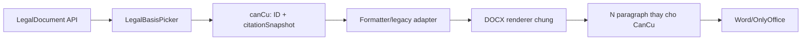

# Báo cáo rà soát hệ thống và đề xuất refactor Thư viện văn bản

**Ngày rà soát:** 28/07/2026  
**Cập nhật triển khai:** 29/07/2026  
**Workspace:** `/home/pcloud/qlda`  
**Phạm vi:** Phần rà soát bên dưới ghi lại hiện trạng trước refactor; mục “Trạng thái triển khai” phản ánh code và kiểm thử mới nhất.

---

## 0. Trạng thái triển khai ngày 29/07/2026

Các hạng mục chính trong báo cáo đã được triển khai vào codebase:

- Form Dự toán, KHLCNT, các bước Lựa chọn nhà thầu và Thanh toán được chia thành các mục lớn đánh số La Mã.
- Có preview realtime bên phải; nội dung thay đổi ngay khi người dùng nhập.
- Dự toán và KHLCNT có luồng hiển thị rõ `Phiếu trình ký → Tờ trình → Quyết định`, tab preview Phiếu trình ký và API tải Phiếu trình ký riêng.
- Danh sách trường trên web lấy placeholder của chính file DOCX làm nguồn sự thật. Nếu mẫu không có `{{CanCu}}`, giao diện và preview không hiển thị mục Căn cứ pháp lý.
- `{{CanCu}}` trong các mẫu có hỗ trợ được thay bằng nhiều Word paragraph thực sự; các mẫu không có placeholder này được giữ nguyên.
- Migration có sẵn bốn căn cứ mẫu (22/2023/QH15, 57/2024/QH15, 90/2025/QH15 và 214/2025/NĐ-CP) để kiểm thử tìm kiếm/chọn nhiều căn cứ.
- Bộ kiểm thử tại `testflow/` đã sinh 16 DOCX xuyên suốt Dự toán → KHLCNT → Chỉ định thầu → Thanh toán/Gói thầu tư vấn.
- Kiểm thử xác nhận không còn placeholder `{{...}}` trong document, header hoặc footer; ba gói thầu tạo đúng dữ liệu lặp; số hợp đồng được nối xuống Thanh toán; phụ lục khái toán được nối vào Quyết định Dự toán.

Chi tiết kết quả sinh file nằm tại `testflow/Kiem_tra_placeholder.md`.

---

## 1. Kết luận điều hành

### 1.1. Trả lời trực tiếp yêu cầu về `{{CanCu}}`

**Có thể dùng duy nhất một placeholder `{{CanCu}}` để sinh ra nhiều căn cứ và tự xuống dòng trong file Word.**

Ví dụ người dùng chọn ba căn cứ:

1. Luật Đấu thầu số 22/2023/QH15;
2. Luật số 57/2024/QH15;
3. Nghị định số 214/2025/NĐ-CP.

Thì một placeholder:

```text
{{CanCu}}
```

có thể được hệ thống mở rộng thành:

```text
Căn cứ Luật số 22/2023/QH15 ngày 23 tháng 6 năm 2023 của Quốc hội khóa XV, Kỳ họp thứ 5 đấu thầu;
Căn cứ Luật số 57/2024/QH15 ngày 29 tháng 11 năm 2024 của Quốc hội ...;
Căn cứ Nghị định số 214/2025/NĐ-CP ngày 04 tháng 8 năm 2025 của Chính phủ ...;
```

Mỗi căn cứ có thể là một paragraph Word riêng, giữ nguyên font, chữ nghiêng, căn lề và thụt đầu dòng đã đặt ở paragraph chứa `{{CanCu}}`.

Tuy nhiên, **code hiện tại chưa làm được việc này một cách đúng và thống nhất**. Các engine hiện chỉ thay placeholder bằng chuỗi XML-escaped. Ký tự `\n` trong chuỗi không tự trở thành paragraph Word; nếu truyền mảng trực tiếp thì JavaScript còn có thể biến mảng thành chuỗi ngăn cách bằng dấu phẩy.

Để đạt đúng kết quả như hình mẫu, cần:

- Đặt `{{CanCu}}` ở một paragraph riêng trong template.
- Chuẩn hóa dữ liệu căn cứ thành một mảng có thứ tự.
- Thay toàn bộ paragraph chứa `{{CanCu}}` bằng N paragraph mới.
- Dùng một renderer DOCX chung thay cho năm bản cài đặt đang bị lặp.

### 1.2. Phương án được khuyến nghị

Phương án phù hợp nhất là:

1. Thay thư viện động hiện tại bằng model cố định `LegalDocument`.
2. Mỗi văn bản pháp lý có đúng sáu trường hiển thị:
   - Số hiệu;
   - Cơ quan ban hành;
   - Hình thức văn bản;
   - Lĩnh vực;
   - Trích yếu nội dung;
   - Ngày ban hành.
3. Tạo component dùng chung để tìm kiếm, chọn nhiều căn cứ, thêm/xóa và sắp xếp.
4. Lưu cả ID văn bản và bản chụp câu viện dẫn tại thời điểm chọn.
5. Chuẩn hóa toàn bộ template pháp lý về `{{CanCu}}`.
6. Tạo renderer DOCX chung có khả năng sinh nhiều paragraph.

### 1.3. Phương án nhanh

Nếu chỉ cần xử lý gấp một số mẫu Word, có thể ghép các căn cứ thành chuỗi và chuyển dấu xuống dòng thành `<w:br/>`.

Đây chỉ là hotfix vì:

- Chỉ tạo ngắt dòng thủ công trong cùng một paragraph.
- Khó điều khiển khoảng cách, thụt đầu dòng và định dạng từng căn cứ.
- Không giải quyết mô hình thư viện, API tìm kiếm hoặc dữ liệu không thống nhất.
- Tiếp tục duy trì logic thay DOCX bị lặp ở nhiều module.

---

## 2. Phạm vi và phương pháp rà soát

Rà soát được thực hiện theo phương pháp tĩnh trên toàn bộ kiến trúc repository, sau đó đi sâu vào các luồng:

- Prisma schema và migrations;
- NestJS modules, controller, service, guard;
- Next.js routes, form fields và API clients;
- Module Thư viện văn bản;
- Các luồng Dự toán, KHLCNT, LCNT, Đặt sách, Thanh toán và Nhà thầu;
- Các engine sinh DOCX;
- 43 file mẫu trong `FileMau`;
- Cấu hình Docker, OnlyOffice, MinIO và authentication;
- TypeScript type-check;
- Dependency security audit.

### 2.1. Quy mô codebase tại thời điểm rà soát

| Hạng mục | Số lượng |
|---|---:|
| File được Git quản lý | 244 |
| File source được index | 168 |
| Backend TypeScript | khoảng 10.966 dòng |
| Frontend TypeScript/TSX | khoảng 19.829 dòng |
| Tổng TypeScript/TSX | khoảng 30.795 dòng |
| Template DOCX | 43 |
| Prisma migrations | 22 |
| File source backup `.bak`/`.bak2` | 4 |

### 2.2. Kết quả kiểm tra kỹ thuật

| Kiểm tra | Kết quả |
|---|---|
| Backend `tsc --noEmit` | Thành công |
| Frontend `tsc --noEmit` | Thành công |
| Unit/integration test chuẩn | Không tìm thấy |
| Backend `npm audit --omit=dev` | 22 cảnh báo: 1 critical, 11 high, 10 moderate |
| Frontend `npm audit --omit=dev` | 5 cảnh báo: 4 high, 1 moderate |

Các script trong `backend/scripts` chủ yếu là script kiểm tra thủ công, chưa tạo thành test suite có thể chạy ổn định trong CI.

---

## 3. Kiến trúc hiện tại

### 3.1. Backend

Backend dùng NestJS 10, Prisma 5 và PostgreSQL. Các module chính gồm:

- Authentication và RBAC;
- Project;
- Documents;
- Đặt sách;
- Dự toán;
- Kế hoạch lựa chọn nhà thầu;
- Lựa chọn nhà thầu;
- Thanh toán;
- Nhà thầu tham dự thầu;
- Thư viện văn bản;
- Chat, notification và MinIO.

Phần lớn dữ liệu nghiệp vụ của tài liệu và các bước được lưu trong cột Prisma `Json`. Điều này giúp phát triển form nhanh, nhưng hiện tạo ra nhiều tên khóa khác nhau cho cùng một khái niệm.

### 3.2. Frontend

Frontend dùng Next.js 14, React 18, Zustand và Tailwind CSS.

Form đang được triển khai theo hai cách:

- Form dùng `SmartFormField`/`GroupedFieldRenderer`;
- Form viết trực tiếp trong từng page.

Vì vậy trường căn cứ pháp lý hiện chưa có một component duy nhất và đang xuất hiện dưới nhiều tên:

- `canCuPhapLy`;
- `CanCuVanBanPhapLy`;
- `TenCacVanBanPhapLyLienQuan`;
- `CanCu`;
- `canCu`.

### 3.3. Luồng DOCX

Hệ thống có hai kiểu sinh DOCX:

1. Sinh bằng code thông qua package `docx`.
2. Đọc file `.docx` như ZIP rồi thay trực tiếp XML trong `word/*.xml`.

Luồng thứ hai được cài đặt lặp lại ở năm vị trí:

| Module | File |
|---|---|
| Đặt sách | `backend/src/dat-sach/dat-sach.controller.ts` |
| LCNT | `backend/src/contractor-selection/lcnt-docx-generator.ts` |
| Dự toán | `backend/src/documents/dutoan-docx-generator.ts` |
| Thanh toán | `backend/src/payment/payment-docx-generator.ts` |
| Nhà thầu tham dự thầu | `backend/src/bid-participation/bid-docx-generator.ts` |

Mỗi nơi có biến thể riêng của:

- `normalizeRuns`;
- `replacePlaceholders`;
- escape XML;
- xử lý alias;
- đọc/ghi `word/document.xml`;
- xử lý header/footer.

Đây là nguyên nhân tạo ra hành vi không đồng nhất và làm tăng rủi ro khi thêm placeholder đặc biệt như `{{CanCu}}`.

---

## 4. Hiện trạng Thư viện văn bản

### 4.1. Database hiện tại

Phần thư viện trong `backend/prisma/schema.prisma` đang sử dụng:

- `Organization`;
- `Library`;
- `LibraryField`;
- `SavedValue`;
- enum `LibraryType`;
- enum `FieldType`.

`LibraryField` mô tả field động. `SavedValue.duLieu` là JSON tùy ý.

Mô hình này được thiết kế để lưu cả:

- Thông tin tổ chức;
- Thông tin nhà thầu;
- Địa chỉ;
- Người ký;
- Mẫu Đặt sách;
- Mẫu Dự toán;
- Mẫu KHLCNT;
- Mẫu LCNT;
- Mẫu Thanh toán.

Nó không phải là model chuyên biệt cho một văn bản pháp lý.

### 4.2. API hiện tại

`DocumentLibraryController` cung cấp CRUD cho:

- Organization;
- Library;
- Fields;
- Saved values.

API lấy danh sách saved value:

```text
GET /api/document-library/library/:id/value
```

đang trả toàn bộ giá trị của thư viện:

- Không có `q` để tìm kiếm;
- Không có phân trang;
- Không có bộ lọc;
- Không có xếp hạng kết quả;
- Không có schema validation cụ thể cho `duLieu`.

### 4.3. Giao diện hiện tại

`frontend/src/components/LibraryPicker.tsx`:

- Tải danh sách thư viện;
- Chọn một thư viện;
- Tải toàn bộ `SavedValue`;
- Hiển thị `tenGiaTri`;
- Không có ô tìm kiếm;
- Không có phân trang;
- Không có hỗ trợ chọn nhiều giá trị trong một field.

Trang admin `frontend/src/app/dashboard/admin/thu-vien-van-ban/page.tsx` phải quản lý bốn tầng Organization → Library → Field → SavedValue. Cấu trúc này phức tạp hơn nhiều so với yêu cầu sáu cột cố định.

### 4.4. Ảnh hưởng khi thay thế hoàn toàn

`LibraryPicker` hiện được import ở nhiều màn hình:

- Đặt sách;
- Dự toán sách;
- Dự toán thiết bị;
- KHLCNT;
- Bước LCNT;
- Bước Thanh toán;
- Nhà thầu tham dự thầu.

Theo quyết định đã chốt, mô hình cũ sẽ được thay thế hoàn toàn. Điều này đồng nghĩa:

- Chức năng “Từ thư viện” cho các nhóm dữ liệu không phải căn cứ pháp lý sẽ bị loại bỏ.
- Chức năng “Lưu thông tin hiện tại vào thư viện” cũng bị loại bỏ.
- Các màn hình trên phải gỡ import và callback liên quan để không gọi API đã bị xóa.
- Chỉ chức năng Thư viện văn bản pháp lý mới được giữ lại.

Đây là thay đổi có phạm vi lớn, cần được ghi rõ trong release note và kiểm thử hồi quy.

---

## 5. Rà soát placeholder căn cứ trong 43 template

### 5.1. Mười một template căn cứ pháp lý cần chuẩn hóa

| Template | Placeholder hiện tại |
|---|---|
| `ChaoHangCanhTranh/Quyết định lựa chọn nhà thầu.docx` | `{{TenCacVanBanPhapLyLienQuan}}` |
| `ChaoHangCanhTranh/Quyết định phê duyệt hồ sơ mời thầu.docx` | `{{TenCacVanBanPhapLyLienQuan}}` |
| `ChaoHangCanhTranh/Tờ trình phê duyệt HSMT.docx` | `{{TenCacVanBanPhapLyLienQuan}}` |
| `ChiDinhThau/Quyết định phê duyệt KQLCNT.docx` | `{{CanCuVanBanPhapLy}}` |
| `ChiDinhThau/Thư mời hoàn thiện hợp đồng.docx` | `{{CanCuVanBanPhapLy}}` |
| `ChiDinhThau/Tờ trình phê duyệt KQLCNT.docx` | `{{CanCuVanBanPhapLy}}` |
| `DauThauRongRai/Quyết định lựa chọn nhà thầu.docx` | `{{TenCacVanBanPhapLyLienQuan}}` |
| `DauThauRongRai/Quyết định phê duyệt hồ sơ mời thầu.docx` | `{{TenCacVanBanPhapLyLienQuan}}` |
| `DauThauRongRai/Tờ trình phê duyệt HSMT.docx` | `{{TenCacVanBanPhapLyLienQuan}}` |
| `DuToan/Quyết định phê duyệt dự toán.docx` | `{{TenCacVanBanPhapLyLienQuan}}` |
| `DuToan/Tờ trình phê duyệt dự toán.docx` | `{{TenCacVanBanPhapLyLienQuan}}` |

Khuyến nghị đổi cả 11 placeholder trên thành:

```text
{{CanCu}}
```

### 5.2. Sáu placeholder không phải căn cứ pháp lý

Các placeholder sau mô tả tài liệu dùng làm căn cứ nghiệm thu/vận hành, không phải danh mục văn bản pháp lý:

| Template | Placeholder nghiệp vụ |
|---|---|
| `GoiThauPhiTuVan/Biên bản nghiệm thu dịch vụ.docx` | `{{TaiLieuCanCuNghiemThu}}` |
| `GoiThauPhiTuVan/Biên bản vận hành thử.docx` | `{{TaiLieuCanCuNghiemThu}}` |
| `GoiThauTrienKhai/Biên bản nghiệm thu cài đặt.docx` | `{{TaiLieuCanCuNghiemThu}}` |
| `GoiThauTrienKhai/Biên bản nghiệm thu tổng thể.docx` | `{{TaiLieuCanCuNghiemThu}}` |
| `GoiThauTrienKhai/Biên bản nghiệm thu đào tạo.docx` | `{{TaiLieuCanCuNghiemThuDaoTao}}` |
| `GoiThauTrienKhai/Biên bản vận hành thử.docx` | `{{TaiLieuCanCuVanHanhThu}}` |

Không đổi sáu placeholder này thành `{{CanCu}}`.

### 5.3. Lưu ý riêng cho Đặt sách

`backend/src/dat-sach/dat-sach.controller.ts` đã có replacement `CanCu`, nhưng file thực tế:

```text
FileMau/DatSach/giay_de_nghi_in.docx
```

hiện không chứa `{{CanCu}}`.

Nếu Giấy đề nghị in cần căn cứ pháp lý, phải thêm một paragraph độc lập chứa `{{CanCu}}` vào template này và bổ sung trường chọn căn cứ trong form Đặt sách.

---

## 6. Vì sao xuống dòng hiện tại chưa hoạt động đúng

Các hàm hiện tại có dạng tương tự:

```ts
return xml.replace(PLACEHOLDER_REGEX, (_match, key) => {
  const value = data[key];
  return escapeXmlText(String(value));
});
```

Có ba vấn đề:

1. `String(['A', 'B'])` tạo ra `A,B`, không tạo dòng hoặc paragraph.
2. `A\nB` nằm trong `<w:t>` không tự tạo `<w:br/>` hay `<w:p>`.
3. Một placeholder có thể bị Word chia thành nhiều `<w:r>/<w:t>`, khiến regex không tìm thấy nếu bước normalize không xử lý đúng.

Trong DOCX:

- `<w:t>` là text;
- `<w:br/>` là ngắt dòng thủ công;
- `<w:p>` là một paragraph.

Muốn kết quả giống văn bản hành chính trong ảnh, nên tạo nhiều `<w:p>`, không chỉ chèn `\n`.

---

## 7. Thiết kế dữ liệu đề xuất

### 7.1. Model `LegalDocument`

Đề xuất thay phần thư viện động bằng model:

```prisma
model LegalDocument {
  id                String   @id @default(uuid())
  soHieu            String   @map("so_hieu")
  coQuanBanHanh     String   @map("co_quan_ban_hanh")
  hinhThucVanBan    String   @map("hinh_thuc_van_ban")
  linhVuc           String   @map("linh_vuc")
  trichYeuNoiDung   String   @map("trich_yeu_noi_dung")
  ngayBanHanh       DateTime @db.Date @map("ngay_ban_hanh")

  // Trường nội bộ, không phải cột nghiệp vụ trên UI.
  searchText        String   @map("search_text")

  createdAt         DateTime @default(now()) @map("created_at")
  updatedAt         DateTime @updatedAt @map("updated_at")

  @@unique([soHieu, coQuanBanHanh, ngayBanHanh])
  @@index([soHieu])
  @@index([ngayBanHanh])
  @@map("legal_documents")
}
```

`searchText` là trường kỹ thuật, được tạo từ sáu trường sau khi:

- Chuyển chữ thường;
- Bỏ dấu tiếng Việt;
- Chuẩn hóa khoảng trắng;
- Giữ nguyên ký tự quan trọng trong số hiệu như `/` và `-`.

Nhờ đó người dùng có thể tìm:

- `22/2023/QH15`;
- `đấu thầu`;
- `dau thau`;
- `Quốc hội`;
- `nghị định`;
- lĩnh vực.

Nếu số bản ghi lớn, migration có thể tạo GIN trigram index cho `search_text`. Với dữ liệu nhỏ, có thể triển khai tìm kiếm `contains` trước và bổ sung index sau.

### 7.2. Validation

Đề xuất cả sáu trường nghiệp vụ là bắt buộc.

Các rule chính:

- Trim khoảng trắng đầu/cuối;
- Không chấp nhận chuỗi rỗng;
- `ngayBanHanh` phải là ngày ISO hợp lệ;
- Chặn bản ghi trùng theo số hiệu + cơ quan + ngày;
- Đặt giới hạn độ dài cho từng trường;
- Không cho client gửi `searchText`, `createdAt`, `updatedAt`.

### 7.3. Cách tạo câu viện dẫn

Công thức đã chốt:

```text
Căn cứ {Hình thức văn bản} số {Số hiệu} ngày {dd} tháng {M} năm {yyyy} của {Cơ quan ban hành} {Trích yếu nội dung};
```

Ví dụ dữ liệu:

| Trường | Giá trị |
|---|---|
| Số hiệu | `22/2023/QH15` |
| Cơ quan ban hành | `Quốc hội khóa XV, Kỳ họp thứ 5` |
| Hình thức văn bản | `Luật` |
| Lĩnh vực | `Đấu thầu` |
| Trích yếu nội dung | `Đấu thầu` |
| Ngày ban hành | `2023-06-23` |

Kết quả:

```text
Căn cứ Luật số 22/2023/QH15 ngày 23 tháng 6 năm 2023 của Quốc hội khóa XV, Kỳ họp thứ 5 đấu thầu;
```

`linhVuc` chỉ dùng để lọc/tìm kiếm và không đưa vào câu.

Formatter phải:

- Không thêm tiền tố `Căn cứ` hai lần;
- Loại dấu `;` hoặc `.` thừa ở cuối thành phần;
- Luôn kết thúc câu bằng một dấu `;`;
- Hiển thị ngày theo `d/M/yyyy`;
- Không tự thay đổi nội dung pháp lý ngoài chuẩn hóa khoảng trắng/dấu câu.

---

## 8. Chuẩn dữ liệu căn cứ trong hồ sơ

### 8.1. Type dùng chung

```ts
type LegalBasisSource = 'LIBRARY' | 'MANUAL';

type LegalBasisSelection = {
  legalDocumentId: string | null;
  source: LegalBasisSource;
  citationSnapshot: string;
};

type LegalBasisField = LegalBasisSelection[];
```

Toàn hệ thống dùng một khóa:

```ts
canCu: LegalBasisField
```

### 8.2. Vì sao phải lưu `citationSnapshot`

Không nên chỉ lưu ID rồi tạo lại câu từ thư viện khi xuất Word.

Ví dụ:

1. Hồ sơ được lập ngày 01/8 và chọn một văn bản.
2. Ngày 05/8 admin sửa trích yếu hoặc cơ quan ban hành trong thư viện.
3. Nếu hồ sơ chỉ lưu ID, Word được tải lại ngày 06/8 sẽ khác bản đã trình ngày 01/8.

Lưu `citationSnapshot` giúp:

- Giữ đúng nội dung đã dùng tại thời điểm lập hồ sơ;
- Văn bản cũ không bị thay đổi khi thư viện được cập nhật;
- Xóa một văn bản khỏi thư viện không làm hỏng hồ sơ đã lập;
- Căn cứ nhập tay có cùng cấu trúc với căn cứ chọn từ thư viện.

### 8.3. Căn cứ nhập tạm

Khi không tìm thấy văn bản, người dùng được phép nhập tạm.

Giá trị lưu:

```ts
{
  legalDocumentId: null,
  source: 'MANUAL',
  citationSnapshot: 'Căn cứ ...;'
}
```

UI nên hiển thị rõ nhãn “Nhập tạm” để phân biệt với dữ liệu chuẩn.

Hệ thống chuẩn hóa:

- Nếu thiếu `Căn cứ`, tự thêm tiền tố;
- Nếu có nhiều tiền tố, chỉ giữ một;
- Nếu thiếu dấu `;`, tự thêm;
- Không tự ghi căn cứ nhập tạm vào thư viện.

### 8.4. Tương thích hồ sơ cũ

Dù xóa thư viện cũ, các hồ sơ đã tạo có thể còn dữ liệu dưới những khóa cũ.

Backend/frontend cần adapter đọc:

- `canCu`;
- `canCuPhapLy`;
- `CanCuVanBanPhapLy`;
- `TenCacVanBanPhapLyLienQuan`;
- `CanCu`.

Quy tắc:

- Nếu đã có `canCu` dạng mảng object, dùng trực tiếp.
- Nếu là mảng string, chuyển mỗi string thành `source: 'MANUAL'`.
- Nếu là textarea/string, tách thận trọng theo xuống dòng; không tách chỉ bằng dấu `;` vì nội dung căn cứ có thể chứa dấu phẩy hoặc dấu chấm phẩy.
- Dữ liệu mới chỉ ghi vào `canCu`.

---

## 9. API đề xuất

### 9.1. Tìm kiếm và danh sách

```http
GET /api/legal-documents?q=22%2F2023%2FQH15&page=1&limit=20
```

Filter tùy chọn:

```text
hinhThuc=
linhVuc=
coQuan=
fromDate=
toDate=
```

Response:

```ts
type LegalDocumentListResponse = {
  items: Array<{
    id: string;
    soHieu: string;
    coQuanBanHanh: string;
    hinhThucVanBan: string;
    linhVuc: string;
    trichYeuNoiDung: string;
    ngayBanHanh: string;
    citation: string;
    createdAt: string;
    updatedAt: string;
  }>;
  total: number;
  page: number;
  limit: number;
};
```

Quy tắc:

- `page >= 1`;
- `1 <= limit <= 50`;
- Exact match số hiệu đứng trước prefix/contains;
- Các kết quả còn lại sắp xếp theo ngày ban hành mới nhất;
- Search được debounce 300 ms ở frontend;
- Query rỗng trả danh sách phân trang, không trả toàn bộ dữ liệu.

### 9.2. CRUD

```http
POST   /api/legal-documents
PUT    /api/legal-documents/:id
DELETE /api/legal-documents/:id
```

Request create/update:

```ts
type LegalDocumentInput = {
  soHieu: string;
  coQuanBanHanh: string;
  hinhThucVanBan: string;
  linhVuc: string;
  trichYeuNoiDung: string;
  ngayBanHanh: string;
};
```

### 9.3. Phân quyền

Controller mới phải gắn:

```ts
@UseGuards(JwtAuthGuard, RolesGuard)
```

Quyền:

| Hành động | ADMIN | USER |
|---|---:|---:|
| Xem/tìm kiếm | Có | Có |
| Tạo | Có | Không |
| Sửa | Có | Không |
| Xóa | Có | Không |

Các route mutation dùng `@Roles(Role.ADMIN)`.

---

## 10. Giao diện đề xuất

### 10.1. Trang quản trị Thư viện văn bản

Giữ URL hiện tại:

```text
/dashboard/admin/thu-vien-van-ban
```

Thay toàn bộ UI Organization/Library/Field/SavedValue bằng:

- Thanh tìm kiếm;
- Filter Hình thức văn bản;
- Filter Lĩnh vực;
- Nút “Thêm văn bản”;
- Bảng đúng sáu cột như yêu cầu;
- Cột thao tác Sửa/Xóa;
- Phân trang;
- Modal tạo/sửa;
- Preview câu `Căn cứ ...;`.

Sáu cột nghiệp vụ:

| Số hiệu | Cơ quan ban hành | Hình thức văn bản | Lĩnh vực | Trích yếu nội dung | Ngày ban hành |
|---|---|---|---|---|---|

Cột “Thao tác” là cột UI quản trị, không phải dữ liệu văn bản.

### 10.2. Component chọn căn cứ

Đề xuất component:

```tsx
<LegalBasisPicker
  value={formData.canCu}
  onChange={(items) => updateForm('canCu', items)}
  disabled={!canEdit}
/>
```

Hành vi:

- Hiển thị `Căn cứ 1`, `Căn cứ 2`, `Căn cứ 3` theo thứ tự;
- Mỗi dòng có combobox tìm kiếm;
- Gõ `22/2023/QH15` sẽ gọi API và hiển thị câu viện dẫn đầy đủ;
- Chọn kết quả sẽ lưu ID + snapshot;
- Không cho chọn trùng cùng một `legalDocumentId`;
- Có nút `+ Thêm căn cứ`;
- Có nút xóa;
- Có nút hoặc drag-and-drop đổi thứ tự;
- Có lựa chọn “Nhập căn cứ tạm”;
- Khi mở lại hồ sơ, giữ đúng thứ tự đã lưu;
- Không đóng dropdown khi đang gõ hoặc tải trang kết quả tiếp theo.

### 10.3. Các màn hình cần tích hợp

Tích hợp vào các trường căn cứ pháp lý của:

- Dự toán;
- Kế hoạch lựa chọn nhà thầu;
- Lựa chọn nhà thầu;
- Quyết định phê duyệt;
- Đặt sách nếu mẫu GDN được bổ sung `{{CanCu}}`;
- Các form khác sử dụng một trong các khóa căn cứ cũ.

Không thay các trường `TaiLieuCanCuNghiemThu*` của module Thanh toán/nghiệm thu.

---

## 11. Renderer DOCX đề xuất

### 11.1. Quy ước template

Trong Word:

1. Tạo một paragraph riêng.
2. Nhập chính xác:

   ```text
   {{CanCu}}
   ```

3. Không viết thêm `Căn cứ:` bên ngoài.
4. Đặt font, cỡ chữ, italic, alignment, first-line indent và spacing cho paragraph.
5. Không đặt placeholder trong bảng nếu template không thực sự cần căn cứ nằm trong cell.
6. Không chia placeholder thành nhiều kiểu định dạng.

Renderer vẫn phải xử lý trường hợp Word tự chia placeholder thành nhiều run.

### 11.2. Thiết kế utility chung

Đề xuất tạo một utility duy nhất, ví dụ:

```text
backend/src/utils/docx-template-renderer.ts
```

API nội bộ:

```ts
type RichPlaceholderValue =
  | string
  | number
  | null
  | undefined
  | { kind: 'paragraphs'; items: string[] };

async function renderDocxTemplate(
  template: Buffer,
  data: Record<string, RichPlaceholderValue>,
): Promise<Buffer>;
```

Luồng xử lý:



### 11.3. Thuật toán cho `{{CanCu}}`

1. Mở DOCX bằng JSZip.
2. Duyệt `word/document.xml` và các header/footer XML.
3. Gom text từ các `<w:t>` để nhận diện placeholder bị chia run.
4. Với placeholder thường, thay text như hiện tại nhưng qua một hàm chung.
5. Với paragraph chỉ chứa `{{CanCu}}`:
   - Lấy `<w:pPr>` của paragraph;
   - Lấy `<w:rPr>` của run placeholder;
   - XML-escape từng `citationSnapshot`;
   - Clone paragraph theo số căn cứ;
   - Mỗi clone chứa một căn cứ;
   - Giữ nguyên thứ tự;
   - Nếu mảng rỗng, xóa paragraph placeholder.
6. Ghi lại các XML part vào ZIP.
7. Sinh buffer DOCX.

Nội dung người dùng phải luôn được XML-escape trước khi ghép với XML cấu trúc.

### 11.4. Hợp nhất năm engine

Các generator sau chuyển sang gọi utility chung:

- `generateFromTemplate` của Đặt sách;
- `generateContractorSelectionDocx`;
- `generateDuToanDocx`;
- `generatePaymentDocx`;
- `generateBidDocx`.

Các generator tạo DOCX bằng package `docx` cũng phải dùng cùng formatter câu căn cứ, dù không cần XML renderer.

---

## 12. Migration và loại bỏ thư viện cũ

Theo quyết định đã chốt, dữ liệu thư viện cũ sẽ bị xóa ngay.

### 12.1. Migration database

Thứ tự đề xuất:

1. Tạo bảng `legal_documents`.
2. Tạo unique/index cần thiết.
3. Xóa bảng `saved_values`.
4. Xóa bảng `library_fields`.
5. Xóa bảng `libraries`.
6. Xóa bảng `organizations`.
7. Xóa enum `LibraryType`.
8. Xóa enum `FieldType`.
9. Regenerate Prisma Client.

Đây là migration phá hủy dữ liệu. Trước khi chạy trên production vẫn nên có database snapshot ở tầng hạ tầng, dù ứng dụng không giữ lại dữ liệu legacy.

### 12.2. Backend cần loại bỏ

- Controller/service/module thư viện động cũ;
- DTO Organization/Library/Field/SavedValue;
- `seed-module-libraries.ts`;
- Lời gọi seed thư viện cũ;
- Enum và model cũ trong Prisma;
- API `/document-library/*`.

Thay bằng:

- `LegalDocumentsModule`;
- `LegalDocumentsController`;
- `LegalDocumentsService`;
- DTO tìm kiếm/create/update;
- Formatter câu viện dẫn.

### 12.3. Frontend cần loại bỏ

- `LibraryPicker` và `SaveToLibraryModal` cũ;
- `document-library-types.ts`;
- API Organization/Library/Field/SavedValue;
- Zustand store thư viện động;
- Callback lưu dữ liệu biểu mẫu vào thư viện;
- Các import còn lại tại bảy nhóm màn hình đang dùng picker cũ.

Thay bằng:

- `legal-document-types.ts`;
- `legal-documents-api.ts`;
- `LegalBasisPicker`;
- Trang admin sáu cột cố định.

### 12.4. Triển khai

Backend, frontend, Prisma migration và template DOCX phải được phát hành trong cùng một release để tránh:

- Frontend cũ gọi API đã bị xóa;
- Backend mới đọc schema cũ;
- Template mới dùng `{{CanCu}}` nhưng renderer cũ không hiểu;
- Template cũ dùng alias không còn được ghi.

Nếu hệ thống không hỗ trợ rolling migration tương thích hai chiều, nên dùng maintenance window ngắn.

Rollback chỉ có thể thực hiện an toàn bằng:

- Rollback code/template;
- Khôi phục database snapshot trước migration.

---

## 13. Các vấn đề toàn hệ thống phát hiện thêm

### 13.1. Mức Critical/High

#### A. Secret được lưu trong source

`docker-compose.yml` đang chứa trực tiếp:

- Database credential;
- JWT secret;
- OnlyOffice JWT secret;
- MinIO secret;
- VAPID private key.

Một số service còn có secret fallback trong source.

Khuyến nghị:

- Chuyển toàn bộ sang secret manager hoặc `.env` không commit;
- Xóa fallback secret mặc định trong production;
- Rotate toàn bộ secret đã từng được commit;
- Không ghi lại giá trị secret trong báo cáo/log.

#### B. `RolesGuard` của Thư viện văn bản chưa hoạt động

`DocumentLibraryController` chỉ dùng:

```ts
@UseGuards(JwtAuthGuard)
```

Mặc dù controller có `@Roles(Role.ADMIN)`, `RolesGuard` chưa được gắn ở controller và cũng không được đăng ký global trong `AppModule`.

Hệ quả: người dùng đăng nhập thông thường có thể gọi các route tạo/sửa/xóa thư viện nếu không có lớp bảo vệ khác.

Controller mới phải dùng cả `JwtAuthGuard` và `RolesGuard`.

#### C. Thiếu object-level authorization

Một số route Project/Documents truyền ID trực tiếp cho service mà không truyền user hiện tại để kiểm tra:

- Xem project;
- Xem summary/log/member;
- Sửa/xóa project;
- Thêm/xóa project member;
- Xem document theo ID/project/parent;
- Tải DOCX/PDF theo ID.

Service có kiểm tra record tồn tại nhưng nhiều method không kiểm tra người gọi là:

- ADMIN;
- Chủ dự án;
- Thành viên dự án;
- Người tạo/được giao tài liệu.

Đây là rủi ro truy cập chéo dữ liệu theo ID và cần một đợt hardening riêng.

#### D. Dependency vulnerabilities

Kết quả audit tại ngày báo cáo:

- Backend: 22 cảnh báo, gồm 1 critical;
- Frontend: 5 cảnh báo, gồm 4 high.

Các package đáng chú ý gồm Nest platform packages, `adm-zip`, `bcrypt`, `multer`, `next`, `sharp` và các dependency bắc cầu.

Không nên chạy `npm audit fix --force` trực tiếp trên production. Cần:

1. Chia nhóm upgrade không breaking và breaking;
2. Nâng từng nhóm;
3. Build/type-check;
4. Chạy regression test cho auth, upload, DOCX, websocket và OnlyOffice.

### 13.2. Mức Medium

#### A. Không kiểm tra quan hệ cha-con trong service thư viện

Khi update/delete field hoặc saved value, service kiểm tra:

- Library tồn tại;
- Field/value tồn tại.

Nhưng chưa xác nhận `field.libraryId` hoặc `value.libraryId` trùng với `libraryId` trên URL.

API mới với model phẳng `LegalDocument` sẽ loại bỏ tầng quan hệ này.

#### B. Tên và kiểu dữ liệu nghiệp vụ không thống nhất

Nhiều form dùng `any` và JSON. Căn cứ pháp lý xuất hiện dưới nhiều key và cả string/mảng.

Khuyến nghị tạo type dùng chung và adapter tại biên API, không tiếp tục thêm fallback rải rác trong từng service.

#### C. Login rate limiter thủ công

Rate limiter:

- Dùng `Map` trong memory;
- Không chia sẻ giữa nhiều instance;
- Có nguy cơ điều kiện path không khớp `/api/auth/login`;
- Không có cơ chế dọn record cũ rõ ràng.

Nên dùng rate-limit middleware/guard tiêu chuẩn và store dùng chung nếu deploy nhiều instance.

#### D. CORS

CORS hiện cho `http://demo.jtsc.vn` trong khi cấu hình ứng dụng dùng `https://demo.jtsc.vn`.

Cần đọc allowed origins từ environment và kiểm tra đúng origin production.

### 13.3. Mức Low/Technical debt

- Có source backup `.bak`, `.bak2` trong repository;
- Không có test framework chuẩn cho backend/frontend;
- Nhiều controller/service lớn;
- Logging dùng `console.log`;
- Logic placeholder alias và normalize bị lặp;
- `SavedValue.duLieu` cho phép dữ liệu bất kỳ;
- Một số script chứa path tuyệt đối `/home/pcloud/qlda`.

---

## 14. Kế hoạch kiểm thử

### 14.1. Backend unit test

#### Formatter

- Tạo đúng câu cho `22/2023/QH15`;
- Format ngày `2023-06-23` thành `23/6/2023`;
- Không lặp `Căn cứ`;
- Không lặp dấu `;`;
- Xử lý `&`, `<`, `>` an toàn;
- Chuẩn hóa căn cứ nhập tạm.

#### Search

- Tìm exact số hiệu;
- Tìm một phần số hiệu;
- Tìm có dấu và không dấu;
- Tìm theo hình thức, lĩnh vực, cơ quan, trích yếu;
- Exact số hiệu đứng đầu;
- Phân trang đúng;
- `limit > 50` bị từ chối hoặc giới hạn.

#### Permission

- USER được GET;
- USER bị 403 khi POST/PUT/DELETE;
- ADMIN CRUD thành công;
- Update/delete ID không tồn tại trả 404;
- Duplicate trả 409/400 có thông báo rõ.

### 14.2. Frontend component test

- Mở dropdown và tìm kiếm;
- Debounce không gọi API cho mỗi keystroke;
- Chọn một văn bản;
- Chọn ba văn bản;
- Không chọn trùng;
- Xóa và đổi thứ tự;
- Nhập tạm;
- Rehydrate dữ liệu từ `canCu`;
- Đọc dữ liệu legacy dạng string/mảng;
- Disabled state không cho sửa;
- Lỗi API và empty state được hiển thị.

### 14.3. DOCX structural test

Với mỗi template:

- Không có căn cứ: paragraph placeholder bị xóa;
- Một căn cứ: có một paragraph;
- Ba căn cứ: có ba paragraph theo đúng thứ tự;
- Không còn `{{CanCu}}`;
- Placeholder bị chia run vẫn được nhận diện;
- Nội dung có `&`, `<`, `>` không làm hỏng XML;
- Paragraph giữ `<w:pPr>`;
- Run giữ `<w:rPr>`;
- Header/footer vẫn được render;
- DOCX ZIP và XML hợp lệ.

### 14.4. DOCX visual test

Mở bằng:

- Microsoft Word;
- OnlyOffice đang dùng trong hệ thống;
- LibreOffice nếu dùng cho chuyển PDF.

Kiểm tra:

- Font;
- Cỡ chữ;
- Chữ nghiêng;
- Căn đều;
- First-line indent;
- Khoảng cách paragraph;
- Dấu `;`;
- Không có dòng trống thừa;
- Không có placeholder sót.

### 14.5. Regression test

- Cả 11 template pháp lý;
- Sáu template `TaiLieuCanCu...` không bị thay đổi;
- Đặt sách;
- Dự toán;
- KHLCNT;
- Ba phương thức LCNT;
- Thanh toán;
- Nhà thầu tham dự thầu;
- Download DOCX/PDF;
- OnlyOffice preview/save;
- Hồ sơ cũ với các tên key legacy.

### 14.6. Acceptance scenario chính

1. Admin tạo văn bản:
   - Số hiệu: `22/2023/QH15`;
   - Cơ quan: `Quốc hội khóa XV, Kỳ họp thứ 5`;
   - Hình thức: `Luật`;
   - Lĩnh vực: `Đấu thầu`;
   - Trích yếu: `Đấu thầu`;
   - Ngày: `23/6/2023`.
2. Người dùng mở form.
3. Gõ `22/2023/QH15`.
4. Hệ thống trả đúng câu viện dẫn.
5. Người dùng chọn ba căn cứ và đổi thứ tự.
6. Lưu hồ sơ, mở lại vẫn đúng thứ tự.
7. Tải Word.
8. Word có ba paragraph, đúng định dạng và không còn `{{CanCu}}`.

---

## 15. Phương án triển khai theo giai đoạn

### Giai đoạn 0 — An toàn trước migration

- Chụp database snapshot;
- Ghi nhận số lượng Organization/Library/Field/SavedValue;
- Sao lưu bản template đang chạy;
- Xác nhận maintenance window;
- Chuẩn bị rollback code + database.

### Giai đoạn 1 — Model và API

- Tạo `LegalDocument`;
- Tạo migration xóa thư viện cũ;
- Tạo formatter/search normalization;
- Tạo CRUD/search API;
- Gắn đúng guards;
- Viết backend tests.

### Giai đoạn 2 — Frontend

- Thay trang admin bằng bảng sáu cột;
- Tạo `LegalBasisPicker`;
- Thêm manual fallback;
- Thêm canonical type `canCu`;
- Gỡ toàn bộ thư viện tự điền cũ;
- Thêm legacy adapter.

### Giai đoạn 3 — DOCX

- Tạo renderer chung;
- Chuyển năm engine sang renderer;
- Đổi 11 template thành `{{CanCu}}`;
- Bổ sung `{{CanCu}}` cho GDN nếu nghiệp vụ yêu cầu;
- Kiểm tra 43 template, đặc biệt sáu placeholder nghiệm thu.

### Giai đoạn 4 — Hardening và rollout

- Chạy toàn bộ test;
- Smoke test trên bản sao production;
- Deploy đồng bộ backend/frontend/migration/template;
- Theo dõi lỗi search, generate DOCX và OnlyOffice;
- Sau khi ổn định, xử lý dependency/security backlog.

---

## 16. Hotfix nhanh nếu chưa thể refactor ngay

### 16.1. Cách làm

1. Giữ dữ liệu căn cứ dạng `string[]`.
2. Formatter tạo từng câu.
3. XML-escape từng câu.
4. Chèn `<w:br/>` giữa các câu tại `{{CanCu}}`.

Ví dụ ý tưởng:

```ts
const lines = canCu.map(formatCitation);
const safeRuns = lines.map(escapeXmlText);
const value = safeRuns.join('</w:t><w:br/><w:t xml:space="preserve">');
```

Phải bảo đảm phần XML cấu trúc do code tạo ra, không cho nội dung người dùng chèn XML trực tiếp.

### 16.2. Giới hạn

- Không có paragraph spacing riêng;
- Khó giữ first-line indent cho từng dòng;
- Có thể không giống hoàn toàn mẫu hành chính;
- Phải sửa nhiều generator nếu áp dụng toàn hệ thống;
- Không có server-side search;
- Không giải quyết schema thư viện cũ;
- Không giải quyết lịch sử snapshot;
- Dễ phát sinh hành vi khác nhau giữa các module.

Hotfix chỉ nên dùng khi cần phát hành ngay một hoặc hai mẫu. Bản chính thức vẫn nên triển khai model `LegalDocument`, `LegalBasisPicker` và renderer paragraph chung.

---

## 17. Thứ tự ưu tiên

| Ưu tiên | Công việc |
|---|---|
| P0 | Khắc phục phân quyền thư viện và rotate secret đã commit |
| P0 | Chụp snapshot trước migration xóa thư viện |
| P1 | Model/API `LegalDocument` và tìm kiếm |
| P1 | `LegalBasisPicker` và chuẩn dữ liệu `canCu` |
| P1 | Renderer DOCX nhiều paragraph |
| P1 | Chuẩn hóa 11 template pháp lý |
| P1 | Test search → chọn 3 căn cứ → Word |
| P2 | Object-level authorization cho Project/Documents |
| P2 | Nâng dependency có critical/high vulnerability |
| P2 | Thiết lập test suite/CI |
| P3 | Dọn file backup, path tuyệt đối và logging |

---

## 18. Kết luận cuối cùng

Yêu cầu chỉ đặt một `{{CanCu}}` trong Word và cho hệ thống tự thêm nhiều căn cứ, tự xuống dòng **hoàn toàn khả thi**.

Giải pháp đúng không phải là nối chuỗi bằng `\n`, mà là:

- Lưu căn cứ dưới dạng mảng có thứ tự;
- Mỗi lựa chọn có ID và `citationSnapshot`;
- Dùng formatter duy nhất;
- Renderer thay paragraph `{{CanCu}}` bằng nhiều paragraph Word;
- Template giữ định dạng tại vị trí placeholder.

Đối với thư viện, mô hình sáu trường cố định phù hợp hơn rõ rệt so với Organization/Library/Field/SavedValue động hiện tại. Nó giúp:

- Tìm kiếm số hiệu nhanh;
- Dữ liệu dễ kiểm soát;
- API rõ ràng;
- UI đơn giản;
- Không phải cấu hình field thủ công;
- Dễ tạo câu căn cứ thống nhất;
- Dễ kiểm thử.

Khuyến nghị triển khai phương án refactor đầy đủ. Hotfix `<w:br/>` chỉ nên là phương án tạm thời khi có yêu cầu phát hành gấp.
